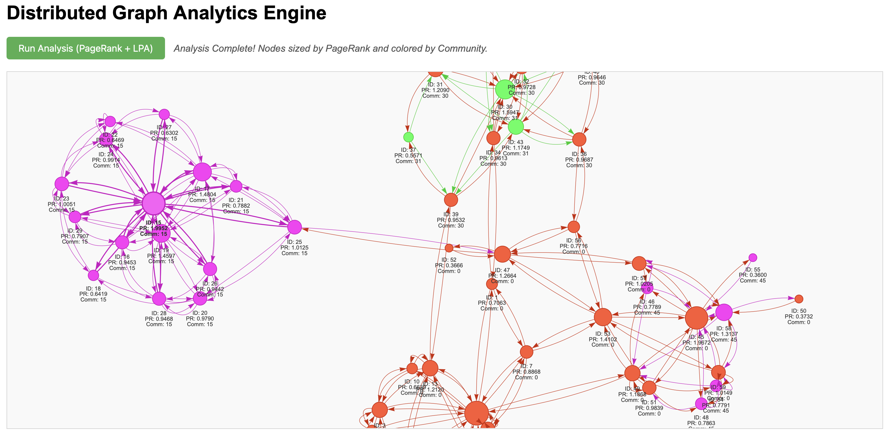

# Distributed Graph Analytics Engine

A high-performance, distributed graph processing engine built with C++17, designed to execute complex graph algorithms like PageRank and Community Detection (Label Propagation) on large-scale datasets. It features a modular architecture supporting **MPI** for distributed memory communication and **OpenMP** for shared-memory parallelism, along with an interactive web-based visualization tool.

## 🚀 Key Features

*   **Distributed Computing**: Implements a vertex-centric programming model (BSP - Bulk Synchronous Parallel) over MPI.
*   **Hybrid Parallelism**: Combines MPI for inter-node communication and OpenMP for intra-node multi-threading.
*   **Efficient Storage**: Uses **Compressed Sparse Row (CSR)** format for memory-efficient graph representation and fast traversal.
*   **Modular Design**: Templated `Engine` class allows easy implementation of new algorithms.
*   **Interactive Visualization**: A Flask + Vis.js web interface to visualize graph structures and analysis results in real-time.
*   **Mock MPI Support**: Includes a mock MPI implementation for seamless development and testing on single-node machines without system MPI installation.

---

## 🏗️ Architecture

The system is divided into two main components: the high-performance C++ Backend and the Interactive Frontend.

### 1. C++ Backend (The Engine)
*   **`Graph` ([Graph.hpp](include/dgraph/Graph.hpp))**: 
    *   Loads and partitions the graph across multiple MPI ranks.
    *   Each rank owns a subset of vertices (1D partitioning) and stores their outgoing edges in CSR format.
*   **`Engine` ([Engine.hpp](include/dgraph/Engine.hpp))**: 
    *   Orchestrates the computation supersteps.
    *   **Scatter Phase**: Parallel iteration (OpenMP) over local vertices to generate messages for neighbors.
    *   **Communication Phase**: Efficient `MPI_Alltoall` and `MPI_Alltoallv` usage to exchange messages between ranks.
    *   **Gather/Apply Phase**: Aggregates incoming messages and updates vertex states.
*   **Algorithms**:
    *   **PageRank**: Iterative link analysis algorithm to measure node importance. Handles dangling nodes via global reduction.
    *   **Label Propagation (LPA)**: Fast community detection algorithm where nodes adopt the most frequent label among their neighbors.

### 2. Visualization Frontend
*   **Flask Server ([app.py](viz/app.py))**: Acts as a bridge between the web UI and the C++ binary. It parses graph files and executes the engine.
*   **Vis.js**: Renders the graph in the browser, allowing for dynamic coloring (Community) and sizing (PageRank) based on analysis results.

---

## 📂 Directory Structure

```
.
├── CMakeLists.txt          # Build configuration (Auto-detects MPI/OpenMP)
├── src/
│   ├── main.cpp            # Entry point (Driver code)
│   └── Graph.cpp           # Graph loading and partitioning logic
├── include/
│   ├── mock_mpi.hpp        # Fallback MPI implementation for single-node
│   └── dgraph/
│       ├── Graph.hpp       # Graph data structure
│       ├── Engine.hpp      # Distributed computation engine
│       ├── MPI_Wrapper.hpp # Toggles between System MPI and Mock MPI
│       └── algorithms/
│           ├── PageRank.hpp
│           └── LabelPropagation.hpp
├── viz/
│   ├── app.py              # Flask server
│   ├── requirements.txt    # Python dependencies
│   └── templates/
│       └── index.html      # Visualization frontend
├── tools/
│   └── generate_graph.py   # Script to generate synthetic social networks
└── data/                   # Input datasets
```

---

## 🛠️ Build & Installation

### Prerequisites
*   **C++ Compiler**: GCC or Clang (supporting C++17)
*   **CMake**: Version 3.14+
*   **Python 3**: For visualization and tools
*   **(Optional) MPI**: OpenMPI or MPICH. *The system automatically falls back to Mock MPI if not found.*
*   **(Optional) OpenMP**: For multi-threading.

### 1. Build the C++ Engine
```bash
# Create build directory
mkdir -p build && cd build

# Configure and compile
cmake ..
cmake --build .
```
This produces the `dgraph_engine` executable in the `build/` directory.

### 2. Set up Visualization
```bash
# Create virtual environment
python3 -m venv venv
source venv/bin/activate

# Install dependencies
pip install -r viz/requirements.txt
```

---

## 🏃 Usage

### 1. Running from Command Line (CLI)

You can run the engine directly on a dataset. The engine expects an edge list file where the first line is the number of vertices.

**Single Node (Mock Mode or Serial):**
```bash
./build/dgraph_engine data/social_network.txt
```

**Distributed (With System MPI):**
```bash
mpirun -n 4 ./build/dgraph_engine data/social_network.txt
```

### 2. Running the Visualization

The visualization tool allows you to see the algorithms in action.

1.  **Generate a Dataset** (Optional, if you want a fresh graph):
    ```bash
    python3 tools/generate_graph.py data/social_network.txt
    ```

2.  **Start the Server**:
    ```bash
    source venv/bin/activate
    python3 viz/app.py
    ```

3.  **Open in Browser**:
    Navigate to `http://127.0.0.1:5000`.

4.  **Interact**:
    *   The graph will load automatically.
    *   Click **"Run Analysis"**.
    *   **Result**: Nodes will resize based on their PageRank score and change color based on their detected Community.



---

## 🧪 Algorithm Details

### PageRank
*   **Logic**: $PR(v) = \frac{1-d}{N} + d \sum_{u \in In(v)} \frac{PR(u)}{OutDeg(u)}$
*   **Implementation**: 
    *   Each rank computes contributions for its local vertices.
    *   Contributions are sent to the owners of destination vertices.
    *   Dangling nodes (no out-edges) are handled by summing their mass globally (`MPI_Allreduce`) and redistributing it.

### Label Propagation (Community Detection)
*   **Logic**: Each node initializes with a unique label. In every iteration, a node adopts the label that is most frequent among its neighbors.
*   **Implementation**:
    *   **Scatter**: Nodes broadcast their current label to neighbors.
    *   **Gather**: Nodes count the frequency of received labels (using `std::map` in the Engine's reducer).
    *   **Apply**: The most frequent label is chosen as the new label.

---

## 🔍 Reproducibility Steps

1.  **Clone/Download** the repository.
2.  **Generate Data**: Run `python3 tools/generate_graph.py data/my_graph.txt`.
3.  **Build**: Run `cmake -B build && cmake --build build`.
4.  **Run**: `./build/dgraph_engine data/my_graph.txt`.
5.  **Visualize**: Start `python3 viz/app.py` and view in browser.

If you encounter "MPI not found", the system is correctly using the **Mock MPI** layer. This is expected behavior on environments without system-level MPI libraries installed.
