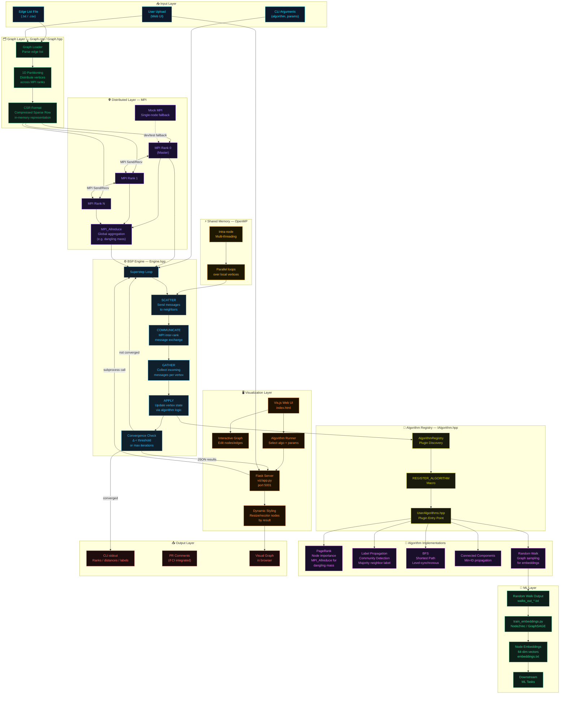

# Distributed Graph Analytics Engine

A high-performance, distributed graph processing engine built with C++17, designed to execute complex graph algorithms like PageRank, BFS, and Community Detection on large-scale datasets. It features a modular architecture supporting **MPI** for distributed memory communication and **OpenMP** for shared-memory parallelism, along with an interactive web-based visualization tool and Machine Learning integration.

## System Architecture


## 🚀 Key Features

*   **Distributed Computing**: Implements a vertex-centric programming model (BSP - Bulk Synchronous Parallel) over MPI.
*   **Hybrid Parallelism**: Combines MPI for inter-node communication and OpenMP for intra-node multi-threading.
*   **Comprehensive Algorithms**:
    *   **PageRank**: For node importance ranking.
    *   **Label Propagation**: For fast community detection.
    *   **Breadth-First Search (BFS)**: For shortest path analysis.
    *   **Connected Components (CC)**: For finding disjoint subgraphs.
    *   **Random Walk**: For generating graph embeddings (Node2Vec/GraphSAGE).
*   **Machine Learning Ready**: Includes tools to train node embeddings (Node2Vec) from graph structure for downstream ML tasks.
*   **Interactive Visualization**: A Flask + Vis.js web interface to visualize graph structures, run algorithms interactively, and edit graphs in real-time.
*   **Extensible Plugin System**: Easily add custom algorithms without modifying the core engine code.
*   **Mock MPI Support**: Includes a mock MPI implementation for seamless development and testing on single-node machines.

---

## 🏗️ Architecture

The system is divided into two main components: the high-performance C++ Backend and the Interactive Frontend.

### 1. C++ Backend (The Engine)
*   **`Graph` ([Graph.hpp](include/dgraph/Graph.hpp))**: Loads and partitions the graph across multiple MPI ranks (1D partitioning, CSR format).
*   **`Engine` ([Engine.hpp](include/dgraph/Engine.hpp))**: Orchestrates the BSP supersteps (Scatter -> Communicate -> Gather -> Apply).
*   **`AlgorithmRegistry` ([IAlgorithm.hpp](include/dgraph/IAlgorithm.hpp))**: Manages algorithm discovery and execution via a plugin system.

### 2. Visualization Frontend
*   **Flask Server ([app.py](viz/app.py))**: Acts as a bridge between the web UI and the C++ binary. It parses graph files, accepts user inputs (algorithm selection, parameters), and executes the engine.
*   **Vis.js UI**: Renders the graph in the browser. Supports:
    *   **Interactive Editing**: Add/remove nodes and edges.
    *   **Algorithm Selection**: Choose between PageRank, BFS, Community Detection, etc.
    *   **Dynamic Styling**: Nodes resize/recolor based on analysis results.

---

## 📂 Directory Structure

```
.
├── CMakeLists.txt          # Build configuration
├── src/
│   ├── main.cpp            # Entry point (CLI & Algorithm Runner)
│   └── Graph.cpp           # Graph loading logic
├── include/
│   ├── dgraph/
│   │   ├── Graph.hpp
│   │   ├── Engine.hpp
│   │   ├── IAlgorithm.hpp  # Algorithm Interface
│   │   ├── algorithms/     # Algorithm Implementations (BFS, PR, CC, etc.)
│   │   └── plugins/        # Plugin Registration (UserAlgorithms.hpp)
├── viz/
│   ├── app.py              # Flask server
│   └── templates/
│       └── index.html      # Web UI
├── scripts/
│   └── train_embeddings.py # ML training script (Node2Vec)
└── data/                   # Input datasets
```

---

## 🛠️ Build & Installation

### Prerequisites
*   **C++ Compiler**: GCC or Clang (C++17 support)
*   **CMake**: Version 3.14+
*   **Python 3**: For visualization and ML tools
*   **(Optional) MPI**: OpenMPI or MPICH. *Falls back to Mock MPI if missing.*

### 1. Build the C++ Engine
```bash
mkdir -p build && cd build
cmake ..
make
```
This produces the `dgraph_engine` executable in `build/`.

### 2. Set up Python Environment
```bash
python3 -m venv venv
source venv/bin/activate
pip install -r requirements.txt
```

---

## 🏃 Usage

### 1. Command Line Interface (CLI)

Run the engine directly on a dataset:

```bash
# Syntax: ./dgraph_engine <graph_file> [algorithm] [params...]

# PageRank (Default)
./build/dgraph_engine data/social_network.txt pr

# Breadth-First Search (Source Node = 0)
./build/dgraph_engine data/social_network.txt bfs 0

# Connected Components
./build/dgraph_engine data/social_network.txt cc

# Random Walk (Length=10, Walks=5)
./build/dgraph_engine data/social_network.txt rw 10 5
```

### 2. Interactive Visualization

1.  **Start the Server**:
    ```bash
    source venv/bin/activate
    python3 viz/app.py
    ```
2.  **Open Browser**: Go to `http://127.0.0.1:5001`.
3.  **Features**:
    *   **Upload**: Upload your own edge list file.
    *   **Edit**: Click "Edit" to modify the graph visually.
    *   **Run**: Select an algorithm (e.g., BFS), enter parameters (e.g., Source Node), and click "Run Analysis".

### 3. Machine Learning (Graph Embeddings)

You can generate node embeddings (like Node2Vec) to use in downstream ML tasks.

1.  **Generate Walks**:
    ```bash
    ./build/dgraph_engine data/social_network.txt rw 10 5
    ```
    This creates `walks_out_*.txt` files.

2.  **Train Embeddings**:
    ```bash
    python3 scripts/train_embeddings.py --walks "walks_out_*.txt" --output embeddings.txt --dim 64
    ```

---

## 🔌 Custom Extensions

You can add your own algorithms using the Plugin System without modifying the core engine.

1.  Create your algorithm class inheriting from `dgraph::IAlgorithm`.
2.  Register it with `REGISTER_ALGORITHM`.
3.  Include it in `include/dgraph/plugins/UserAlgorithms.hpp`.

See **[README_EXTENSIONS.md](README_EXTENSIONS.md)** for a detailed tutorial.

---

## 🧪 Algorithm Details

*   **PageRank**: Measures node importance. Uses `MPI_Allreduce` for dangling node mass redistribution.
*   **Label Propagation**: Fast community detection. Nodes adopt the majority label of neighbors.
*   **BFS**: Computes shortest path distance from a source. Uses level-synchronous expansion.
*   **Connected Components**: Propagates smallest node ID to find disjoint sets.
*   **Random Walk**: Simulates random walkers for sampling graph structure.
